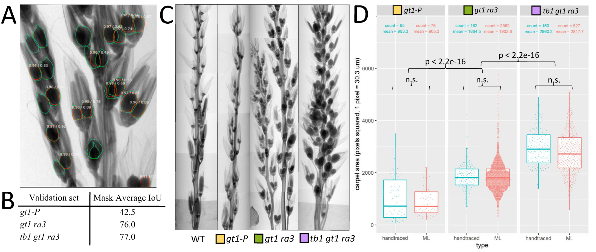

# Measuring flower carpels using Mask_RCNN [(Explore data in RShiny)](https://aednv.shinyapps.io/carpelArea/)  

Carpel Mask-RCNN accurately predicts differences in carpel size. A) Example detections from a *tb1 gt1 ra3* maize tassel x-ray. Blue outlines are the hand-traced ground truth and orange are the Mask-RCNN detections. Above each prediction is the confidence score / pixel Intersect over Union (IoU) score. B) Average pixel Intersect over Union (IoU) scores for genotype specific validation sets. C) Stitched x-ray scans of wildtype, *gt1-P*, *gt1 ra3*, and *tb1 gt1 ra3* maize tassel branches. D) Comparison of *gt1-P*, *gt1 ra3*, and *tb1 gt1 ra3* carpel area calculated from hand-traced (blue) and Mask-RCNN machine learning (ML) (orange) datasets. Total carpel count and mean carpel area is shown above each dataset.  

